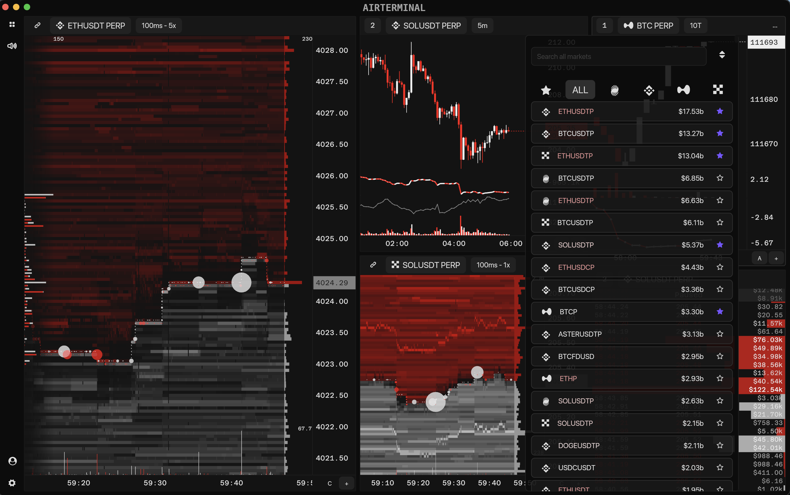

Airterminal
================

Airterminal is a high-frequency market intelligence platform engineered for professional traders who need sub-second clarity on market microstructure. Built in Rust with the `iced` GUI toolkit and a GPU-accelerated visualization stack, the platform ingests depth-of-book and on-chain signals from leading derivatives venues, fusing them into a single, latency-aware trading cockpit.

Why Airterminal?
-------------------
- **High-frequency analysis** with an architecture tuned for <100&nbsp;ms data refresh and rendering paths across the entire visualization stack.
- **Exchange breadth** spanning Bybit, Binance, Hyperliquid, and OKX, with a unified schema for order book, trade, and derivatives-specific metrics.
- **Open source** under the GNU GPL-3.0, inviting the community to collaborate on the next generation of real-time market tooling.
- **Future-ready** design: execution adapters are in development so the same telemetry layer can drive automated trading.

Signature Visual Analytics
--------------------------
- **100&nbsp;ms Heatmap:** Adaptive-resolution order book heatmap, refreshed every 100&nbsp;ms, highlighting liquidity walls, iceberg absorption, and imbalance churn.
- **Hyperliquid On-Chain Heatmap:** Combines L2 order flow with on-chain intelligence—transactions, user hashes, and wallet clustering—to reveal smart money participation in real time.
- **Tick & Candlestick Charts:** Micro-tick streams for tape reading plus multi-timeframe candlesticks with volume overlays and session markers.
- **Footprint Charts:** Bid/ask delta, volume profile, and absorption visualization per price level.
- **Realtime CVD & Open Interest:** Cumulative volume delta and open interest analytics across supported exchanges, updated tick-by-tick.
- **Realtime Trades Tracking:** Stream-aligned trade blotter with aggressor side detection, block trade surfacing, and optional sound cues.
- **Time & Sales Enhancements:** Histogram-styled tape, measure tool (Shift+Click), and pane cloning for rapid comparative studies.

Alerting & Workflow
-------------------
- **Sound Alerts:** Configurable audio cues for liquidity shifts, large prints, open interest spikes, and custom technical triggers.
- **Frequent Updates:** Hot-reloadable configuration and continuous delivery pipeline keep the desk current with exchange API changes and new alpha signals.
- **Workspace Customization:** Multi-pane dashboards, detachable monitors, and keyboard-driven layouts optimize for high-touch execution environments.
- **Telemetry & Insights:** Supabase-backed usage logging captures feature adoption, session health, and update rollouts with privacy-conscious defaults.

Data & Telemetry Stack
-----------------------
- **Workspace Modules:** Modular crates for `data`, `exchange`, and `supabase` isolate feed handlers, analytics, and telemetry to keep the core UI responsive.
- **Feed Handlers:** Optimized Rust connectors for Bybit, Binance, Hyperliquid, and OKX with backpressure-aware buffering and failover.
- **Latency Profiling:** Built-in metrics for end-to-end latency tracking, ensuring sub-100&nbsp;ms delivery from exchange to viewport.
- **Storage & Replay:** Rolling windows of depth and trade data for intraday replay, anomaly investigation, and model backtesting.

Roadmap Highlights
------------------
- Automated order execution adapters leveraging the existing market insight backbone.
- Extended alerting with ML-driven anomaly detection and regime classification.
- More on-chain enrichments (wallet labels, funding flows) for cross-venue correlation.
- Strategy scripting interface for rapid prototyping of custom indicators.
- Community-driven translations, advanced accessibility tooling, and optional privacy-preserving telemetry toggles.

Getting Started
---------------
1. Grab the latest Mac and Windows builds from [airterminal.xyz/download](https://www.airterminal.xyz/download).
2. Install Rust (nightly toolchain recommended for optimal performance).
3. Clone the repository and initialize submodules: `git clone ... && cd Airterminal && git submodule update --init --recursive`.
4. Build the desktop client: `cargo build --release`.
5. Launch the dashboard: `cargo run --bin airterminal`.

License & Contact
-----------------
Airterminal is released under the GNU General Public License v3.0. Contributions are welcome via pull requests—please open an issue first for significant feature proposals so we can align on architecture and logging standards. For partnership inquiries, API access, or early trading integration, reach the core team at `airterminal@protonmail.com`.